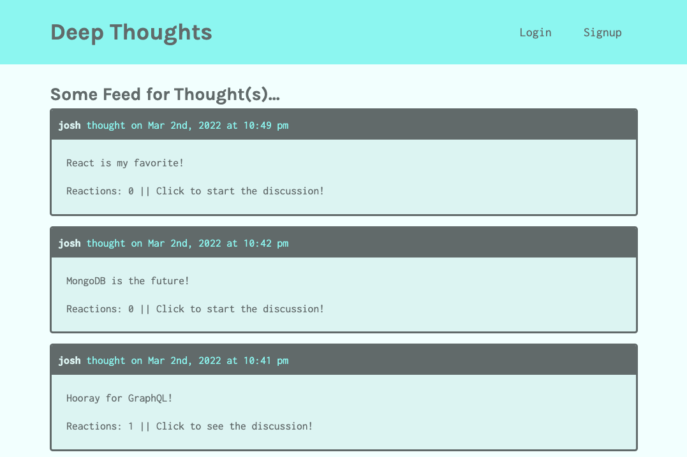

# Deep Thoughts
MERN Stack Social Media App

https://deep-thoughts2100.herokuapp.com/

## Table of Contents

- [Installation](#installation)
- [Usage](#usage)
- [License](#license)
- [Contributions](#contributions)
- [Technologies](#technologies)
- [Credits](#credits)
- [Questions](#questions)

## Installation

Use "npm install" to install required modules for this application. 

## Usage

Read and scroll through thought posts freely as a guest. Create a user if you would like to create and share your own thoughts. Clicking a thought allows you to view a single thought and the user who created it. Click a user to view their thoughts. Add a friend by clicking the button on the right when viewing someone's profile. Write a reaction to a thought you find interesting.  

## License

This project is licensed under the MIT license.

## Contributions

Fork the project and create a pull request. Let us know how you think you can contribute!

## Technologies

Created with HTML, CSS, JavaScript, MongoDB, Express.js, React.js, Node.js, Mongoose, GraphQL, and Apollo. Deployed with Heroku and MongoDB Atlas. 

## Credits

Created by Joshua Schermann.

## Questions

Post an issue if you see a bug or suggested improvement.